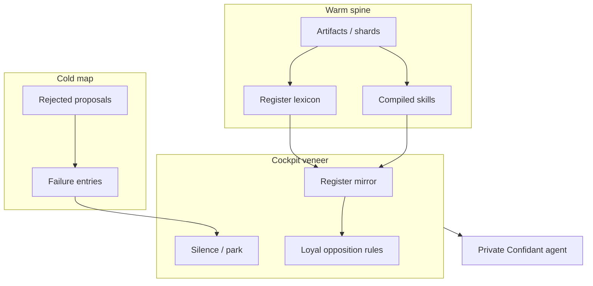

# Private Confidant — Knowledge Architecture

Date: 2026-07-23  
Status: Draft → Scaffolding  
Depends on: [Cockpit Contract](./2026-07-23-private-confidant-cockpit-contract-design.md), [Register Mirror](./2026-07-21-register-mirror-private-confidant-design.md)

## Intent

Build a **canonical knowledge spine** for Pcon that is:

- **Orienting** (artifact + procedure + senses), not DNA-alone  
- **LM-light** on the hot path (prechew / shards / lexicon / cold map need no LM)  
- **Negative-first where it matters** (slop / cold map as first-class citizens)  
- **Veneer-ready** (runtime can load packs without treating `.md` skills as the soul)

Skills (book-to-skill) remain a **compile regress** — useful fuel, not the architecture.

## Epistemology fork (design law)

| Store | Role |
| --- | --- |
| **Warm spine** | Owned artifacts, shards, register lexicon, procedural skills — “where to step” |
| **Cold map** | Failures, bad cites, wrong framings, rejected proposals — “where we already burned” |

Do not train Pcon on the infinite manifold of “correct philosophy.” Accumulate **static failures** asynchronously; shrink known bad basins under human read-audit.

## Canonical layout (ArbiterOS consumer)

```text
backend/core/legal/
  seeds/
    private-confidant.v1.json          # live register pack (existing)
  pcon/
    cockpit.contract.json              # machine-readable cockpit rules
    knowledge/
      README.md
      spine/                           # warm: pointers to owned sources
        manifest.v1.json
      cold-map/                        # negative cartography
        schema.json
        entries/                       # one JSON per failure citizen
      proposals/                       # optional mirror of pending lexicon props
```

Producer side (unchanged ownership):

```text
book-pipeline/library/new/
  artifacts/  export/  lexicon/  lexicon/proposals/
  CORPUS_QUARANTINE.md
```

Agent skills (`~/.claude/skills/tfx-treasury-reclamations`, …) are **compile outputs** referenced by spine manifest — not copied into the repo unless promoted.

## Layers



### 1. Warm spine (`spine/manifest.v1.json`)

Manifest entries point at:

- `source_kind`: `artifact | shard_export | lexicon | skill | tfx_url`  
- `path` or `uri`  
- `domain`: `fed_treasury | ucc | capacity | trust_structure | procedure`  
- `trust`: `owned | compiled | external_ref`  
- `epistemic_ceiling`: max band this source may support (`institutional`, `settled`, …)

No full book text in-repo. Pointers + hashes when available.

### 2. Cold map (`cold-map/`)

Each entry:

- `failure_id`, `surface` (what went wrong in operator/agent language)  
- `kind`: `bad_cite | wrong_sense | public_filler | procedure_miss | myth_as_settled | tool_skip`  
- `why_static` — why this stays wrong  
- `corrective_pointer` — optional spine/lexicon ref  
- `status`: `active | retired`  
- `source_refs` — session/tool ids when known  

Cold map is **citeable in-session** (future tool: `consult_cold_map`). v1 scaffold = schema + README + 1–2 seed failures from known Pcon risks (e.g. collapsing “lawful money” contested → settled; inventing TFX clocks).

### 3. Register lexicon

Existing pack + propose/merge. TFX proposals stay in book-pipeline `lexicon/proposals/` until human merge into live seed.

### 4. Compiled skills

Optional. Linked from spine. Never auto-injected as unsettled doctrine.

### 5. DNA

Optional stamp on artifact. Not a spine node by itself. Not required for Pcon demo.

## Build sequence (acute)

1. **Cockpit contract** wired into Private Confidant instruction (veneer). — done  
2. **Scaffold** `backend/core/legal/pcon/` + schemas + spine manifest (TFX + lexicon pointers). — done  
3. **Cold map schema + seed entries** (negative citizens). — done  
4. **`consult_cold_map` tool** + `POST /api/pcon/cold-map/consult` — done (2026-07-23)  
5. **Hypothesis Ledger (belt-enforced)** — pre-truth / strategy store; see [2026-07-24-hypothesis-ledger-belt-enforced-design.md](./2026-07-24-hypothesis-ledger-belt-enforced-design.md).  
6. **Later**: spectral/Cartographer ingest of shards — orientation geometry, not chat memory.  
7. **Pacioli** — surgical convert done (orientation skill); lexicon proposals still human-merge.

## Non-goals

- Rebuilding spectral-terrain inside ArbiterOS this slice.  
- Converting Pacioli / reality-guide.  
- Auto-promoting TFX lexicon proposals.  
- Growth step content from this architecture.

## Success for scaffold slice

- Specs exist and cross-link.  
- `pcon/cockpit.contract.json` + knowledge dirs committed.  
- Runtime Private Confidant instruction includes loyal-opposition + cold-map awareness.  
- Spine manifest lists TFX skill + live lexicon + quarantine rule.
